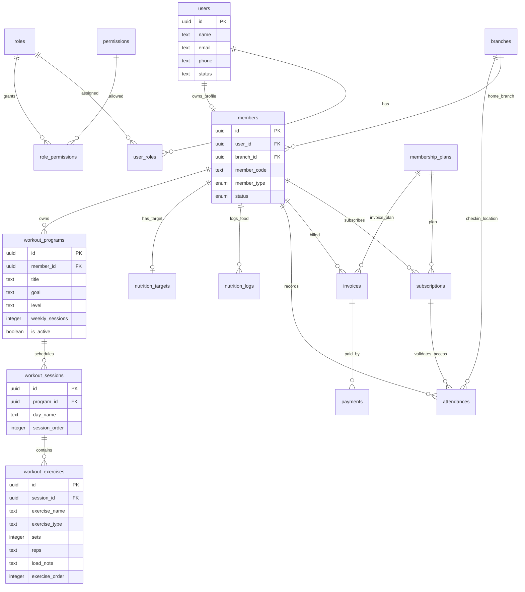
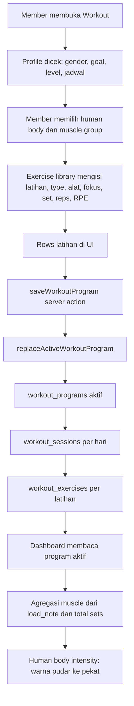
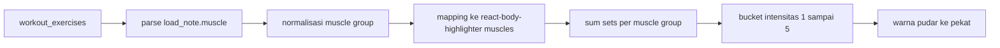
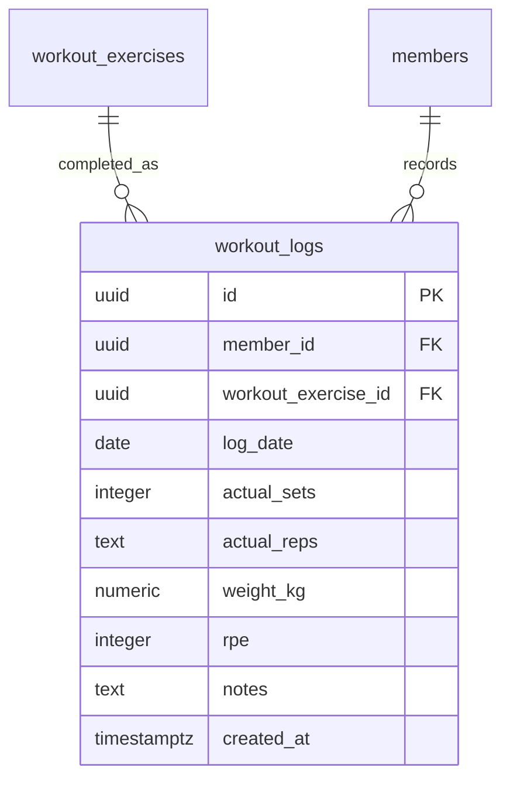

# Skematik Database dan Alur Data Gym App

Dokumen ini menjelaskan relasi data utama, khususnya membership, attendance, nutrition, dan workout progress yang dipakai dashboard member.

## ERD Utama



## Alur Data Workout



## Format Metadata Workout Saat Ini

Kolom `workout_exercises.load_note` menyimpan metadata terstruktur dengan format key-value:

```text
focus:Quadriceps · pendukung: Glutes, Hamstrings|muscle:Quads|equipment:Machine|note:Set 3-4 · RPE 7-8 · Jaga lutut searah...
```

Dashboard memakai:

- `muscle` untuk menentukan area body highlighter.
- `sets` untuk menghitung intensitas latihan.
- `exercise_name` untuk daftar latihan yang membentuk intensitas.
- `reps` untuk progres latihan harian dan calendar.

## Aturan Agregasi Body Highlighter



Mapping utama:

| Muscle group | Body highlighter muscles |
| --- | --- |
| Chest | `chest` |
| Back | `upper-back`, `trapezius` |
| Shoulders | `front-deltoids` |
| Rear Shoulders | `back-deltoids` |
| Biceps | `biceps` |
| Triceps | `triceps` |
| Core | `abs`, `obliques` |
| Quads | `quadriceps` |
| Lower Back | `lower-back` |
| Hamstrings | `hamstring` |
| Glutes | `gluteal` |
| Calves | `calves` |
| Cardio | `quadriceps`, `hamstring`, `calves` |
| Full Body | `chest`, `upper-back`, `quadriceps`, `hamstring`, `abs` |

## Catatan Data Agar Tetap Rapi

- Sumber utama progress workout sekarang adalah `workout_exercises`.
- Program aktif ditandai oleh `workout_programs.is_active = true`.
- Saat program disimpan ulang, program lama dinonaktifkan dan program baru dibuat agar snapshot jadwal tetap konsisten.
- `load_note` wajib tetap menyertakan `focus`, `muscle`, `equipment`, dan `note` agar dashboard bisa melakukan agregasi.
- Untuk versi lanjutan, progres aktual harian bisa dibuat lebih detail dengan tabel `workout_logs` yang mereferensikan `workout_exercises`.

## Rekomendasi Tabel Lanjutan untuk Progress Aktual



Dengan tabel ini, dashboard bisa membedakan antara program rencana dan progres aktual yang benar-benar dilakukan member.
